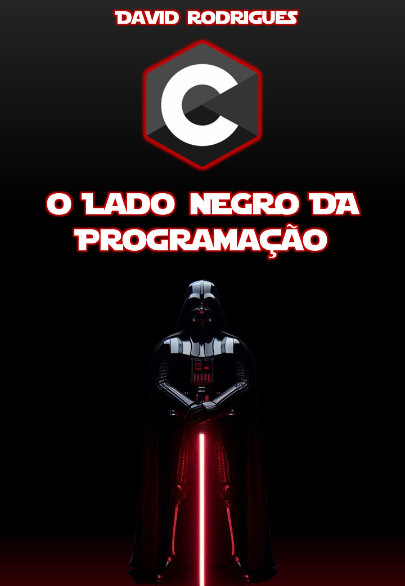

    

-------

# Projeto EBOOK Gerado por I.A.s

> ℹ️ **NOTE:** Este foi um repositório desenvolvido durante o curso na plataforma da [DIO](https://dio.me)

Projeto com o objetivo de gerar um ebook digital com as facilidades das ferramentas de IA.

<a href="https://github.com/DavidRBz/DIO-Ebook/blob/main/output/C%20-%20O%20Lado%20Negro%20da%20Programa%C3%A7%C3%A3o%20-%20Ebook.pdf" title="View PDF now"> 📕Clique aqui para ler</a>

PS: O título foi escolhido mais pelo impacto visual do que pela representatividade do conteúdo.
 
## 💻 Tecnologias utilizadas no projeto

- [ChatGPT](https://chatgpt.com/) 
- [Copilot Designer](https://copilot.microsoft.com/images/create)
- [Photopea](https://www.photopea.com/)
- [PowerPoint](https://www.microsoft.com/en/microsoft-365/powerpoint)

## 🧠 Prompts

ChatGPT：

|   Ação   | Prompt                                                                                                                                                                                                                                                                         |
| :------: | ------------------------------------------------------------------------------------------------------------------------------------------------------------------------------------------------------------------------------------------------------------------------------ |
|  Título  | Crie um título de um ebook sobre o tema da linguagem de programação C. O ebook é do nicho de programação, e o subnicho é de C. O título deve épico e curto, e tenha uma temática de Star Wars, me liste 10 variações de títulos.                                               |
| Conteúdo | Faça um texto para ebook , com foco em C, listando os conceitos básicos, estruturas de condição e repetição, vetores e matrizes. {REGRAS} Explique sempre de uma maneira simples; Deixe o texto enxuto; Sempre traga exemplos de código em contextos reais; Sempre deixe um título sugestivo por tópico |

Copilot Designer：

|  Ação  | Prompt                                                                                 |
| :----: | -------------------------------------------------------------------------------------- |
| Imagem | Darth vader, fullbody, standing facing the camera, against a pitch black background. He is holding a red lightsaber straight down in front of him with both hands, his arms are crossed, and he is looking straight ahead, his head is slightly tilted down, as if in thought. There's light reflecting in his armor, but the source is not visible anywhere. The floor is pitch black, with the only visible part being the light from the lightsaber that weakly in it. |

[Link para o prompt](https://copilot.microsoft.com/images/create/darth-vader2c-fullbody2c-standing-facing-the-camera2c/1-66a663d6f3544949b5ed68b87906a10e?id=f%2BuXljagWA5bjJvGl%2BDmwQ%3D%3D&view=detailv2&idpp=genimg&thid=OIG3.op7bD78cC6psXw6jic9R&form=GCRIDP)

## ✨ Features

- Conteúdo gerado via ChatGPT
- Imagens geradas via Copilot Designer

## 📚 Materiais

- Imagens utilizadas em `assets`
- Ebook gerado durante as aulas em `output`

## 👨‍💻 Expert

    

    
&nbsp&nbsp&nbspDavid RBz 
    &nbsp&nbsp&nbsp
    <a href="https://github.com/DavidRBz">
    GitHub</a>&nbsp;|&nbsp;
    <a href="www.linkedin.com/in/felipe-exe">LinkedIn</a>
&nbsp;|&nbsp;

  

---

⌨️ com 💜 por [David RBz](https://github.com/DavidRBz)
